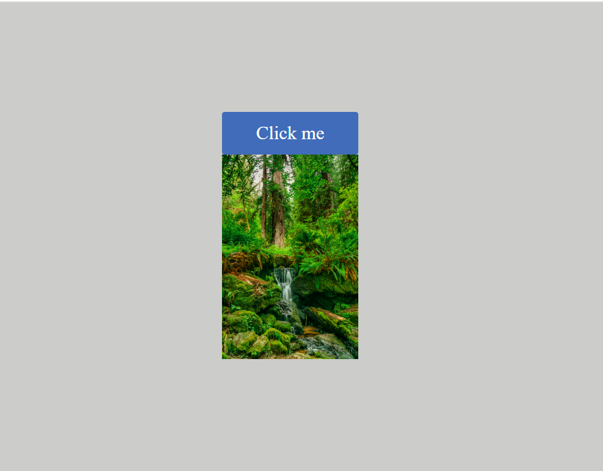

# Full Page Component with Modal

This project demonstrates a full-page component with an integrated modal. The component includes a  image, overlay, and a modal triggered by a "Click me" button.

## Screenshots



*The "Click me" button is visible at the top, and the background image.*


*The modal with the title, content, and "OK" button.*

## Getting Started

To get started with this project, follow these steps:

1. Clone the repository:

   ```bash
   git clone [https://github.com/shashikantRupin/travelopia-assignment]
## Usage
Open the index.html file in your preferred web browser.
